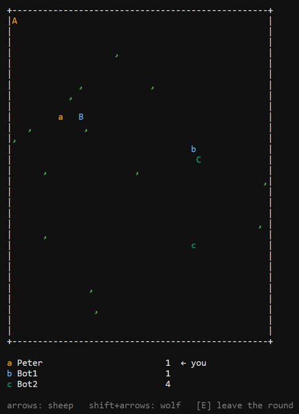

# Sheep, Wolves & Grass

A browser-based, multiplayer (1–10 players), real-time ASCII game. Your sheep
(`a`) grazes for points, your wolf (`A`) hunts the other players' sheep.



Server-authoritative game loop over WebSockets, bots, an
optional turn-based "chess mode", and a tunable configuration API.

**Status: in development.** The design is complete; implementation is underway.
See [SPEC.md](./SPEC.md) for the full specification, [DECISIONS.md](./DECISIONS.md)
for the design-decision log, and [TODO.md](./TODO.md) for the work breakdown.

## Quick start (development)

Requires Node.js ≥ 20.

```sh
npm install
npm run dev
```

- Client dev server: <http://127.0.0.1:5173> (esbuild, rebuilds on reload)
- Game server: restarts on source changes (tsx watch); serves nothing yet

> **Windows note:** if the checkout path contains `&` (e.g.
> `C:\dev\Sheep, Wolves & Grass`), npm's default `cmd.exe` script shell breaks.
> Either clone to a plain path (recommended) or add a local `.npmrc` with
> `script-shell=C:\Program Files\Git\bin\bash.exe`.

## Repository layout

| Path      | Package       | Contents                                             |
| --------- | ------------- | ---------------------------------------------------- |
| `shared/` | `@swg/shared` | Protocol, config schema & types, pure game rules     |
| `server/` | `@swg/server` | Game engine, lobby, WebSocket play API, config API   |
| `client/` | `@swg/client` | Vanilla-TS ASCII renderer (`<pre>`), input, WS client |

## Scripts

| Command                | What it does                                      |
| ---------------------- | ------------------------------------------------- |
| `npm run dev`          | Server (watch) + client (serve) concurrently      |
| `npm run build`        | Production bundles → `server/dist`, `client/dist` |
| `npm run typecheck`    | `tsc --noEmit` across all three packages          |
| `npm run lint`         | ESLint                                            |
| `npm run format`       | Prettier (code only; docs are hand-wrapped)       |
| `npm test`             | Vitest (shared rules/config/protocol tests)       |

## License

[MIT](./LICENSE)

---

*Assisted-by: Claude (Anthropic)*
